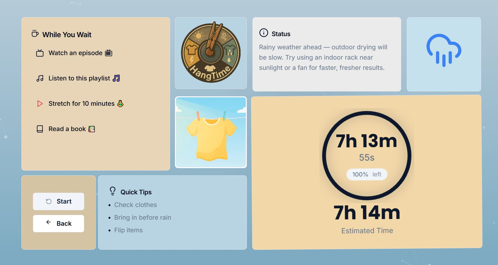
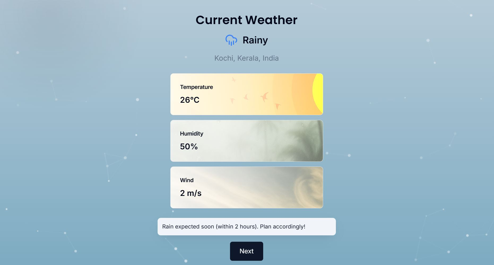
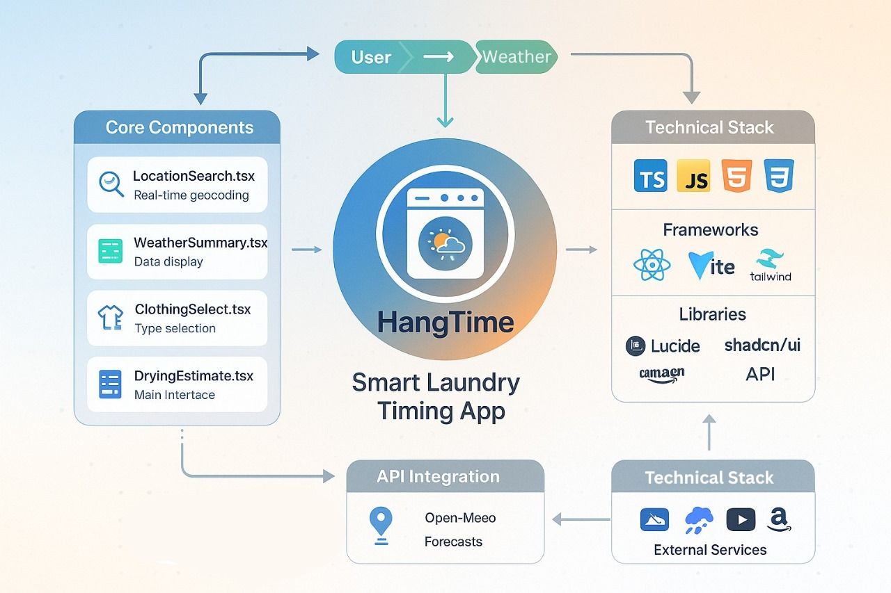

# HangTime 🎯

## Basic Details
**Team Name:** Groove  

**Team Members**  
- **Team Lead:** Ashwin A – CUSAT, SOE  
- **Member 2:** Adithya M – CUSAT, SOE  

---

## Project Description
HangTime is a **smart laundry timing app** that tells you *exactly* when to hang your clothes outside based on **real-time weather data**.  
It calculates **drying times**, gives **weather alerts**, and even suggests fun activities while you wait.  

---

## The Problem (That Doesn’t Exist)
Who has the time (or patience) to check the weather, calculate humidity, and guess if their socks will dry before the rain?  
People are wasting *precious minutes* staring at clouds and hoping their laundry survives. The struggle is… questionably real. 🧦☁️  

---

## The Solution (That Nobody Asked For)
We built an app that does all the thinking for you:  
- Enter your **location**  
- Select your **clothing type**  
- Get **precise drying time estimates** with a beautiful **bento grid dashboard**  
- Enjoy curated activity suggestions while you wait — Netflix, YouTube Music, Kindle, or even stretching tutorials  
- All with **animated particles** in the background, because why not?  

---

## Technical Details

### Technologies/Components Used
**For Software:**  
- **Languages:** TypeScript  
- **Frameworks:** React 18 + Vite  
- **Libraries:** Tailwind CSS, shadcn/ui, Lucide React  
- **APIs:** Open-Meteo (weather), Nominatim (geocoding)  
- **Tools:** VS Code, Git, npm  

---

## Implementation  

### Installation
```bash
# Clone the repository
git clone https://github.com/yourusername/hangtime.git

# Navigate into the project
cd hangtime
```


### Run
```bash
# Start the development server
npm run dev

# Build for production
npm run build

# Preview production build
npm run preview
```

## Project Documentation

### Screenshots

  
*Main dashboard showing drying time, weather status, and activity suggestions in a bento grid layout.*

  
*REACTIVE Particle animation background with interactive weather cards.*

  
*Location search interface using Nominatim API with debounced results.*

---

### Diagrams

  
*System architecture showing the flow from user input and geolocation, through weather API calls, to drying time calculation and activity suggestion rendering in the UI.*
